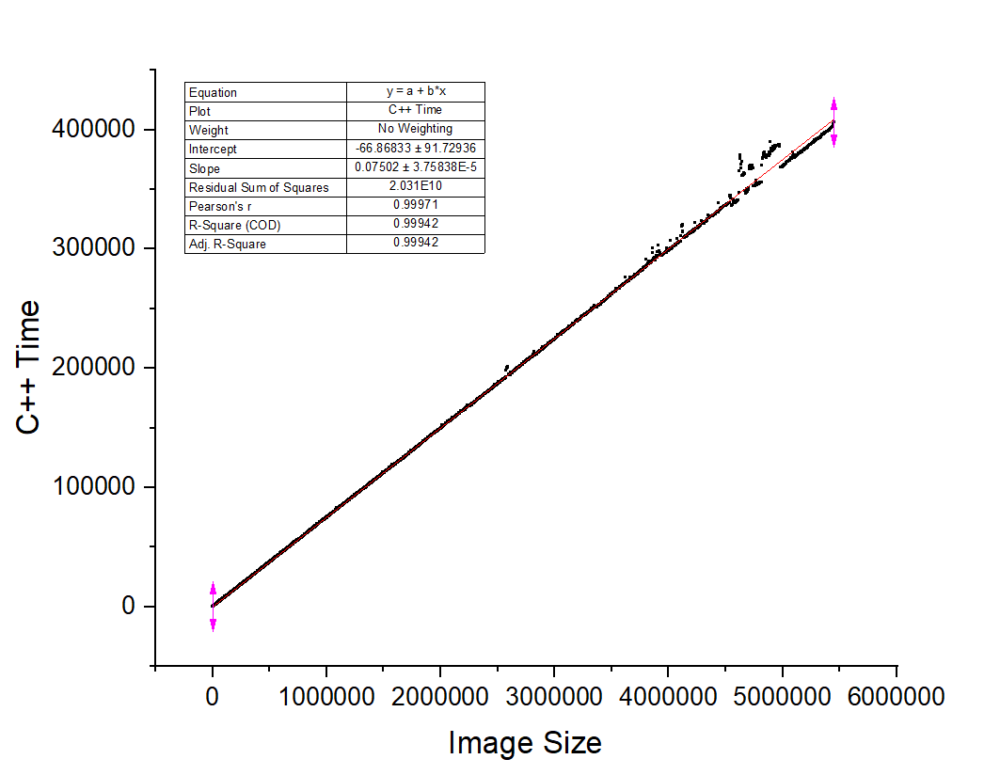
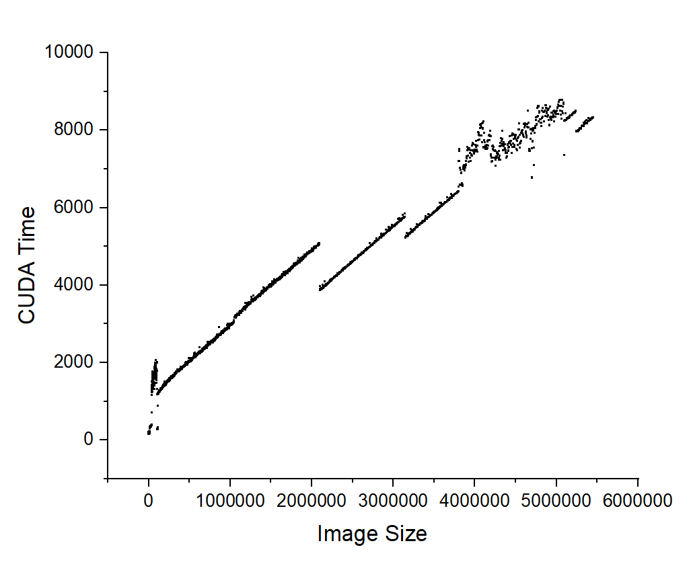

# Image Procesing with CUDA
This is my 3rd year honnor stage project in which i will compair image processing algorythams on the CPU using C++ and on the GPU using CUDA. After this I will move forward to analising the preformace of both implementationsa and explore any diferences

## The Algorithms
At the moment I have fully implemented 1 algorithm and implemented another only in c++. 
- [**Sobel**](###Sobel)
- [**K-Means Clustering**](###K-Means-Clustering)

### Sobel
The sobel opperator is an edge detecting algorithm that returns all the edges in an image. Additionaly it can also return the direction of each edge. My implementation only return the edge without the directions.

This is an exaple image of the Sobel opperator running on a sample image. The image on the left is the original and the one on the right is the one returned from the opperator.

Here are 2 graphs I have made showing the preformace of the algorithm on both the C++ and CUDA implementations.

### K-Means Clustering
K-Means Clustering is a method of partitioning data. This is done by choosing the amount of clusters and then moving the cluster center point closer and closer to the center of similar data point. In terms of images, data points refure the the colour of the pixels.

Here you can see the result of this clustering. On the left is the original image and on the right is the resultant image. In this example i made 5 clusters and iterated 10 times.

